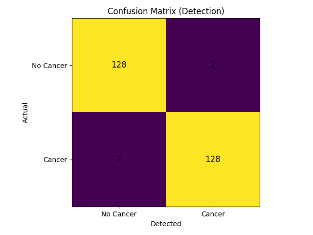
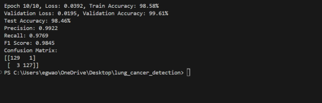
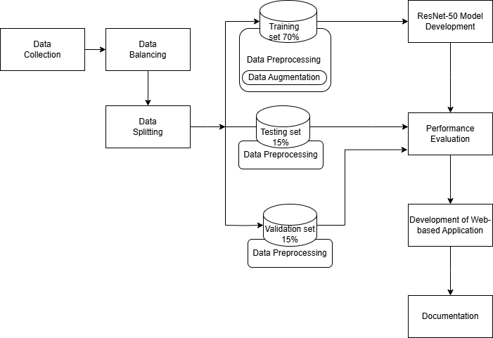
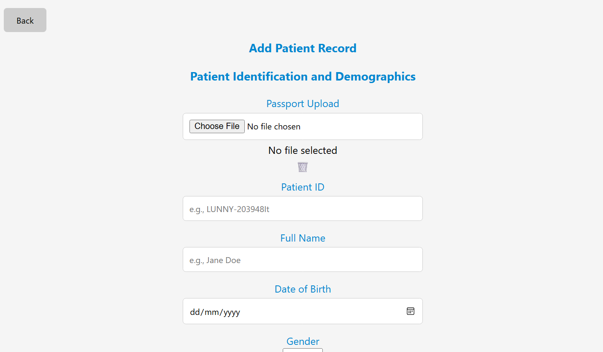
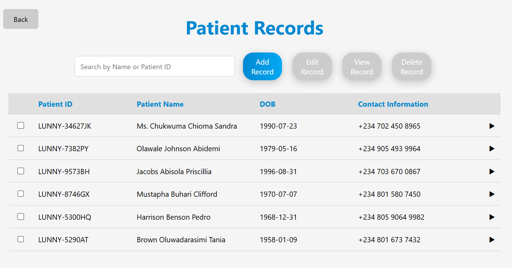
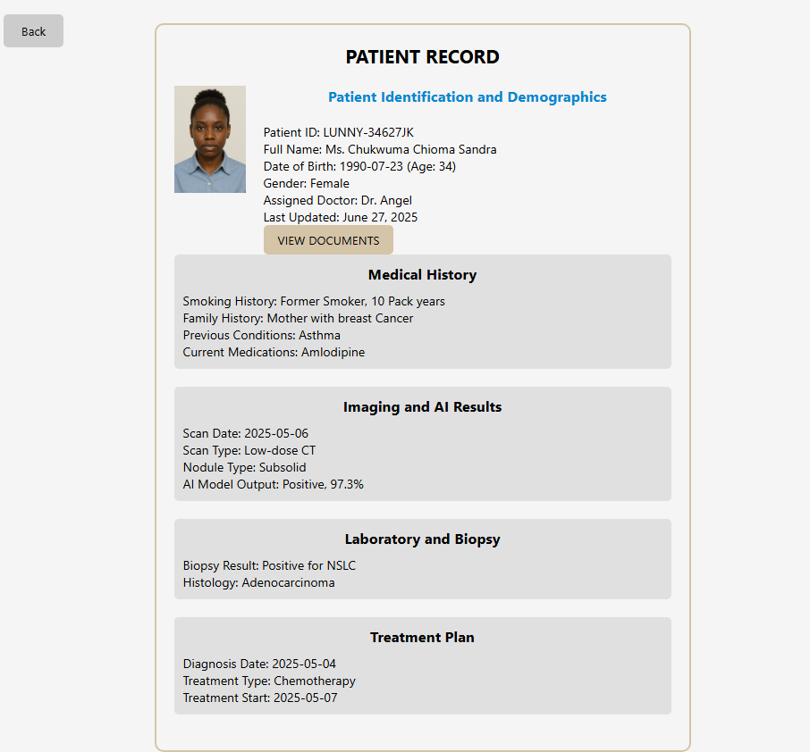
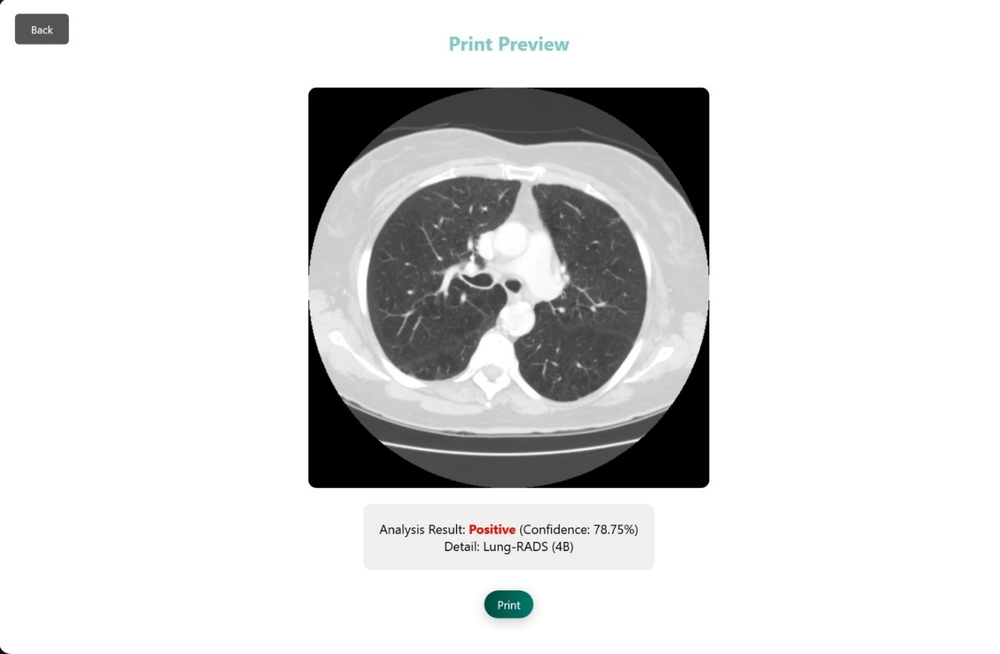

# Lung Cancer Detection System Using ResNet50 on CT Scans 🫁

## Overview
This project presents a deep learning–based lung cancer detection system
developed using Computed Tomography (CT) scan images. The system utilizes
a transfer learning approach based on the ResNet50 architecture to classify
lung CT scans as either **cancerous** or **non-cancerous**.

The trained model was integrated into a web-based application named **LUNNY**,
designed to support early lung cancer detection and assist healthcare
professionals in medical image analysis.

---

## Motivation
Lung cancer remains the leading cause of cancer-related deaths worldwide,
largely due to delayed diagnosis. Manual analysis of CT scans can be
time-consuming and error-prone, especially under high clinical workloads.

This project demonstrates how deep learning can be used to improve diagnostic
accuracy, reduce delays, and support clinical decision-making in lung cancer
detection.

---

## Dataset
CT scan images were collected from three publicly available datasets:

- IQ-OTH/NCCD
- LIDC-IDRI
- BIR Lung Dataset

After balancing, a total of **1,720 CT scan images** were used:
- 860 cancerous
- 860 non-cancerous

### Data Split
- Training: 70%
- Validation: 15%
- Testing: 15%

> ⚠️ Due to size and privacy constraints, the datasets are not included in
> this repository.

---

## Methodology

### Image Preprocessing
- Images resized to **224 × 224 pixels**
- Converted to RGB format
- Normalization applied for stable training
- Independent preprocessing for each dataset split

### Data Augmentation (Training Only)
- Horizontal and vertical flipping
- Rotation (±10°)
- Random cropping
- Color jittering

---

## Model Architecture
- Base Model: **ResNet50 (ImageNet pre-trained)**
- Transfer learning approach
- Early layers frozen
- Final layers fine-tuned for binary classification
- Dropout rate: 0.5

**Output Classes**
- Cancerous
- Non-cancerous

---

## Training Details
- Framework: PyTorch
- Optimizer: Adam
- Learning rate scheduling
- ReLU activation
- Early stopping based on validation performance

---

## Results
The model achieved strong performance on unseen test data:

- **Accuracy:** 98.46%
- **Recall:** 99.21%
- **Precision:** 97.69%
- **F1-score:** 98.45%

### Confusion Matrix

### Test Results

---

## System Architecture

---

## Web Application Deployment (LUNNY)

### Landing Page

### Terms and Conditions Page

### Post-Login Dashboard

### Upload & Analysis Result

### Add Patient Records

### Patient Records Table

### View Patient Record

### Printable Patient Result

---

## Disclaimer
This system is intended **strictly for research and educational purposes**.
It is not a certified medical device and must not be used as a replacement
for professional medical diagnosis, treatment, or clinical decision-making.

All outputs generated by this system should be reviewed and interpreted by
qualified healthcare professionals.

---

## Author
**Angel Egwaoje**

---

## Future Work
- Expansion of dataset size
- Integration of explainable AI (XAI)
- Multi-view and 3D CT scan analysis
- Clinical validation and deployment
